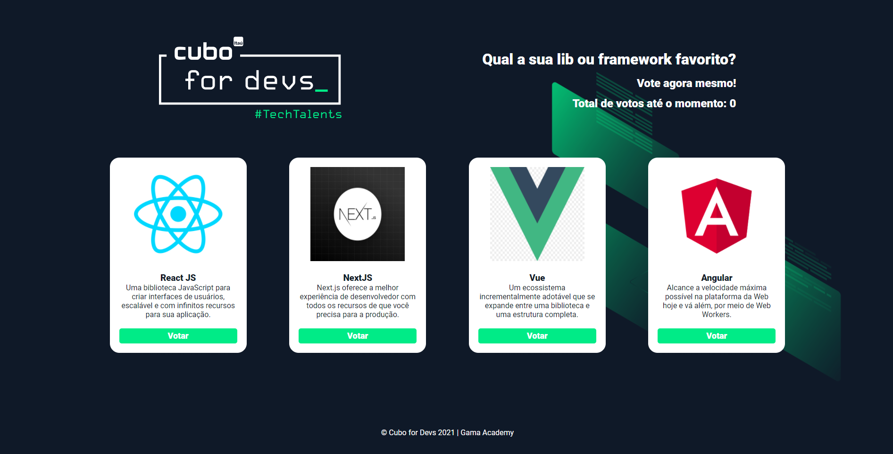

# Sistema de votação de popularidade de frameworks 

## Descrição do Projeto 💻

Aplicação para medir a popularidade dos principais frameworks e libs do mercado e saber qual é o queridinho entre o(a)s Dev(a)s utilizando web API.  
Exercício prático desenvolvido como parte integrante da aula do Professor Douglas Morais para Cubo for Devs | Gama Academy.
Veja o conteúdo da aula no YouTube:

[Clique aqui](https://www.youtube.com/watch?reload=9&v=uslyHgJcrFY).

### Status do Projeto: 

Em desenvolvimento :warning:

### Começando 🏁

Para conseguir utilizar o template basta fazer o download do projeto ou clonar este repositório utilizando o Git em seu terminal.

### Pré-requisitos :large_orange_diamond:

Editor de texto de sua preferência, neste projeto foi utilizado o [VSCode](https://code.visualstudio.com).

Para instalar as dependências do projeto:

### `npm`

Iniciar o projeto em desenvolvimento:

### `npm start`

Para abrir em modo de desenvolvimento acesse: [http://localhost:3000](http://localhost:3000) do seu navegador.

Iniciar o JSON Server

### `json-server --watch db.json`

### Tecnologias 🛠 

As seguintes ferramentas foram usadas na construção do projeto:

- [React](https://pt-br.reactjs.org/)
- [TypeScript](https://www.typescriptlang.org/)
- [React-Router-Dom](https://reactrouter.com/)
- [Styled Components](https://styled-components.com/)

### Criado por:

Feito com ❤️ por Francislene Oliveira 👋🏽 Entre em contato!
 

### Licença

